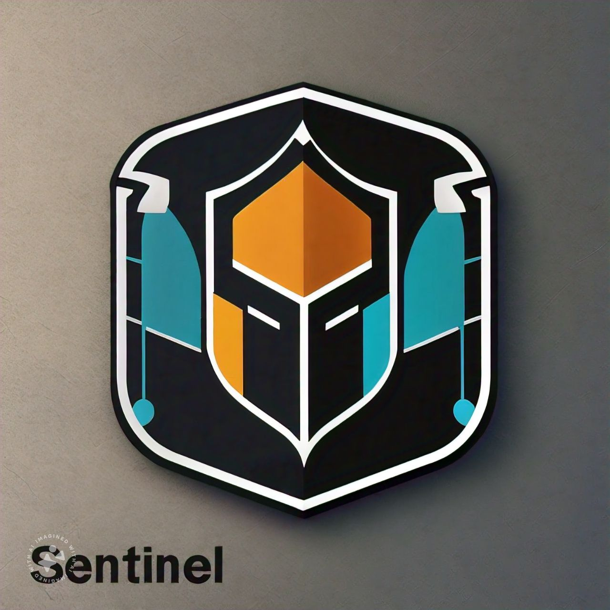

<p align="center">
  
</p>
<p align="center">
    <h1 align="center">SENTINEL</h1>
</p>
<p align="center">
    <em>Real-time Data to Grafana Cloud 🚀 🌍 Azure Events Hub Scalability 💪 🔥 Modular Response Structures 💫 🕰 Clean Configuration Interfaces 🔄 🚀 Seamless Authentication Interfaces 🛡️ 📈 Prometheus to Grafana Bridge 🌐</em>
</p>
<p align="center">
	
	
	
	
</p>
<p align="center">
	<!-- default option, no dependency badges. -->
</p>

<br>

##### 🔗 Table of Contents

- [Overview](#overview)
  - [Benefits](#benefits)
- [Features](#features)
  - [Prerequisites](#prerequisites)
- [Integration with Synthetics](#integration-with-synthetics)
  - [Sentinel Pipeline](#sentinel-pipeline)
- [📦 Installation](#-installation)
  - [Run Synthetics Docker image](#run-synthetics-docker-image)
    - [🤖 Run Synthetics via Docker CLI](#-run-synthetics-via-docker-cli)
    - [🧪 Stop The Synthetics Container](#-stop-the-synthetics-container)
  - [Run Synthetics via Docker Compose](#run-synthetics-via-docker-compose)
    - [Before you begin](#before-you-begin)
    - [Run the latest stable version of Synthetics](#run-the-latest-stable-version-of-synthetics)
    - [Stop the Sentinel container](#stop-the-sentinel-container)
- [Configure a Sentinel Docker image](#configure-a-sentinel-docker-image)
  - [Run a specific version of Synthetics](#run-a-specific-version-of-synthetics)
  - [Default Environment Variable](#default-environment-variable)
- [Configuring the Exports](#configuring-the-exports)
  - [Eventshub Export](#eventshub-export)
    - [From Identity](#from-identity)
    - [From Connection String](#from-connection-string)
- [Output Dataformat](#output-dataformat)
  - [Sample Success Output](#sample-success-output)
  - [Failure Output](#failure-output)
- [📌 Project Roadmap](#-project-roadmap)
- [🤝 Contributing](#-contributing)
- [🎗 License](#-license)
- [🙌 Acknowledgments](#-acknowledgments)

---

##  Overview

**Sentinel: Infinite Worker for Synthetic Monitoring and Uptime Checks**

This repository implements an infinitely running worker service named "Sentinel". 

Its primary function is to perform synthetic monitoring and uptime checks for various services based on configurations defined in a JSON file (`config.json`).

### Benefits

- Proactive monitoring of critical services for increased uptime and reliability.
- Customizable configuration for tailored checks and data collection.
- Scalable data export for further analysis and alerting.

This project provides a robust foundation for building a synthetic monitoring infrastructure tailored to your specific needs. The configuration flexibility allows for easy integration with various service types and desired monitoring intervals.

---

##  Features
- **Scheduled Monitoring:** Utilizes cron expressions for scheduling periodic checks based on need.
- **Configurable Targets:** Leverages a configuration file to define targets (URLs) and desired behaviors.
- **Uptime Validation:** Verifies endpoint responses against specified valid status codes to determine uptime status.
- **Extensible Data Export:** Supports exporting monitoring results to an eventhub for further analysis and alerting.

---

###  Prerequisites

**Synthetics**: Synthetics should be up and running on a reachable endpoint. If synthetics are not found you won't be able to start this worker and this worker will crash giving error. 

Check out about synthetics [here](https://github.com/HealthCheckHQ/synthetics).

---


## Integration with Synthetics

The provided `sample-config.json` [here](sample-config.json) demonstrates the capabilities:

```
{
  "synthetics": [{"url": "http://localhost:3000", "location": "default"}],
  "originParameters": [{
    "cronExpression": "* * * * *",
    "name": "Mailmodo Internal Server",
    "labels": [{"servicename": "allBackend"}],
    "uptimeConfiguration": {
      "validStatusCodes": [200, 201]
    },
    "originConfiguration": {
      "requestType": "get",
      "url": "https://service-api.mailmodo.com",
      "authentication": "NONE",
      "timeout": 5000,
      "followRedirect": false
    }
  }, {
    "cronExpression": "* * * * *",
    "name": "Email Open Click Tracker",
    "labels": [{"servicename": "eventsBackend"}],
    "uptimeConfiguration": {
      "validStatusCodes": [200, 201]
    },
    "originConfiguration": {
      "requestType": "get",
      "url": "https://tracker.mailmodo.email/opens/health",
      "authentication": "NONE",
      "timeout": 5000,
      "followRedirect": false
    }
  }],
  "export": {
    "type": "EVENTHUB", 
    "config": {
      "eventHubNamespace": "EVENTHUB_NAMESPACE",
      "eventHubName": "EVENTHUB_NAME",
      "azureClientId": "AZURE_CLIENT_ID",
      "exportToPrometheusFormat": true
    }
  }

}
```

### Sentinel Pipeline

Pipeline can be defined via json file as define above. To define the pipeline we need to do provide the json file as define the path in environment variable. Following sections are needed in json file. 
```typescript
export class SentinelParameters {
  @IsArray()
  @ArrayUnique()
  @ArrayMinSize(1)
  @Type(() => SyntheticParameter)
  synthetics: SyntheticParameter[];

  @IsArray()
  @ArrayMinSize(1)
  @ValidateNested({ each: true })
  @Type(() => OriginParameters)
  originParameters: OriginParameters[];

  @IsObject()
  @IsNotEmptyObject()
  @ValidateNested()
  @Type(() => ExportParameters)
  export: ExportParameters;
}
```

**Synthetics** - Defines health check edge server. Make sure you have hosted syntehtics at different location and have the endpoint read. You can configure the array of endpoints and their location in the json.
```typescript
export class SyntheticParameter {
  @IsArray()
  @ArrayUnique()
  @ArrayMinSize(1)
  @IsUrl({ require_protocol: true, host_whitelist: ['localhost'] }, { each: true })
  url: string;

  @IsString()
  location: string;
}
``` 
**Origin Parameters** - Set the cron expression. The cron is evaluated as per the [node-cron library](https://www.npmjs.com/package/node-cron). This will set the frequency at which you would like the origin to be probed. <span style="color:red">Don't set the frequency too low that can overwhelm the node promises. For example: if the endpoint resolved in 5sec and you set the probe frequency at 1 second. These promises will accumulate and it will ultimately crash Sentinel</span>.
  - Each origins has a descriptive name.
  - You can pass labels in case you want to categorize further in database. 
  - Verify the response codes to be considered healthy.
  - You can set other parameters in json that is needed for healthcheck.
  ```typescript
    export class OriginParameters {
      @IsString()
      name: string;

      @IsOptional()
      @Type(() => Map<string, string>)
      labels: Map<string, string>;

      @IsString()
      cronExpression: string;

      @IsObject()
      @Type(() => UpTimeConfiguration)
      uptimeConfiguration: UpTimeConfiguration;

      @IsObject()
      @Type(() => UpTimeConfiguration)
      originConfiguration: OriginConfiguration;
    }


    export class OriginConfiguration {
    @IsEnum(RequestType)
    public requestType: RequestType;

    @IsUrl()
    public url: string;

    @IsEnum(AuthenticationType)
    public authentication: AuthenticationType;

    @IsNumber()
    @Min(1000)
    @Max(60000)
    public timeout: number;

    @IsOptional()
    @IsObject()
    public queryParams?: Record<string, string>;

    @IsOptional()
    @IsObject()
    public headers?: Record<string, string>;

    @IsBoolean()
    public followRedirect: boolean;

    @IsOptional()
    public body?: object;

    @IsOptional()
    public token?: string;

    @IsOptional()
    public userName?: string;

    @IsOptional()
    public password?: string;
  }

  export class UpTimeConfiguration {
    @IsArray()
    @ArrayMinSize(1)
    validStatusCodes: Array<number>;
  }

  ```
**Export** - Now the final part of pipeline is where you want to export the data. Right now Only Azure Eventshub is supported. But you can quickly add your own adapter and export the data whichever database or API or Queues you like. Refer [contibution guidelines](#-contributing) to quicky build your adapter. 


---

## 📦 Installation

### Run Synthetics Docker image
This topic guides you through installing Synthetics via the official Docker images. Specifically, it covers running Synthetics via the Docker command line interface (CLI)

Docker images is as follows:

**Synthetics** - [avneesh001/synthetics](https://hub.docker.com/repository/docker/avneesh001/synthetics/general)

The default images for Synethetics are created using the Alpine Linux project and can be found in the Alpine official image. 

#### 🤖 Run Synthetics via Docker CLI

To run the latest stable version of Synthetics, run the following command:

```bash
❯ docker pull avneesh001/synthetics
❯ docker run  -v /path/to/json-config:/usr/src/lib/config --env=EVENTHUB_CONNECTION_STRING="Endpoint=sb://ev-name.servicebus.windows.net/;SharedAccessKeyName=RootManageSharedAccessKey;SharedAccessKey=access_key" --env=EVENTHUB_NAME=evh-events --env=EVENTHUB_NAMESPACE=ev-name.servicebus.windows.net --name=synthetics avneesh001/sentinel -d
❯ docker run --name=sentinel avneesh001/sentinel
```

where 
 - docker run is a Docker CLI command that runs a new container from an image
 - -d (--detach) runs the container in the background
 - -p <host-port>:<container-port> (--publish) publish a container’s port(s) to the host, allowing you to reach the container’s port via a host port. In this case, we can reach the container’s port 3000 via the host’s port 3000
 - --name assign a logical name to the container (e.g. synthetics). This allows you to refer to the container by name instead of by ID.
 - avneesh001/sentinel is the image to run
 - docker run is a Docker CLI command that runs a new container from an image
 - -d (--detach) runs the container in the background
 - -v help to mount the local file where we have config.json into container path
 - --env passes the environment variable needed for docker to run.
 - --name assign a logical name to the container (e.g. synthetics). This allows you to refer to the container by name instead of by ID.

#### 🧪 Stop The Synthetics Container
```bash
#The `docker ps` command shows the processes running in Docker
❯ docker ps
# This will display a list of containers that looks like the following:
CONTAINER ID   IMAGE               COMMAND             CREATED        STATUS         PORTS                    NAMES
f2cf8380eb4d   sentinel:latest   "./entrypoint.sh"   32 hours ago   Up 8 seconds   '             '  sentinel

# To stop the synthetics container run the command
# docker stop CONTAINER-ID or use
# docker stop NAME, which is `synthetics` as previously defined
❯ docker stop sentinel
```

---

### Run Synthetics via Docker Compose
Docker Compose is a software tool that makes it easy to define and share applications that consist of multiple containers. It works by using a YAML file, usually called docker-compose.yaml, which lists all the services that make up the application. You can start the containers in the correct order with a single command, and with another command, you can shut them down. For more information about the benefits of using Docker Compose and how to use it refer to [Use Docker Compose](https://docs.docker.com/get-started/workshop/08_using_compose/).

#### Before you begin
To run Synthetics via Docker Compose, install the compose tool on your machine. To determine if the compose tool is available, run the following command:

```bash
❯ docker compose version
```
If the compose tool is unavailable, refer to [Install Docker Compose](https://docs.docker.com/compose/install/).

#### Run the latest stable version of Synthetics
This section shows you how to run Synthetics using Docker Compose. The examples in this section use Compose version 3. For more information about compatibility, refer to [Compose and Docker compatibility matrix](https://docs.docker.com/reference/compose-file/legacy-versions/).

To run the latest stable version of Synthetics using Docker Compose, complete the following steps:
1. Create a `docker-compose.yaml` file.
```bash
# first go into the directory where you have created this docker-compose.yaml file
cd /path/to/docker-compose-directory

# now create the docker-compose.yaml file
touch docker-compose.yaml
```
2. Now, add the following code into the `docker-compose.yaml` file. For Example:-
```bash
services:
  synethetics:
    image: avneesh001/synthetics
    container_name: synthetics
    restart: unless-stopped
    volumes:
     - ./folder-path-to-json:/usr/src/lib/config
    environment:
     - SENTINEL_CONFIG_PATH=usr/src/lib/config/config.json
     - EVENTHUB_CONNECTION_STRING="Endpoint=sb://ev-name.servicebus.windows.net/;SharedAccessKeyName=RootManageSharedAccessKey;SharedAccessKey=access_key"
     - EVENTHUB_NAME=evh-events
     - EVENTHUB_NAMESPACE=ev-name.servicebus.windows.net

docker compose up -d
```
Where:
- d = detached mode
- up = to bring the container up and running

To determine that Sentinel is running, console should start printing some logs.

#### Stop the Sentinel container
To stop the Sentinel container, run the following command:
```bash
docker compose down
```

---

## Configure a Sentinel Docker image
This topic explains how to run Sentinel on Docker in complex environments that require you to:
 - Use different images
 - Define secrets on the Cloud

### Run a specific version of Synthetics
To run a specific version of Synthetics, add it in the command section:

```bash
docker run  -v /path/to/json-config:/usr/src/lib/config --env=EVENTHUB_CONNECTION_STRING="Endpoint=sb://ev-name.servicebus.windows.net/;SharedAccessKeyName=RootManageSharedAccessKey;SharedAccessKey=access_key" --env=EVENTHUB_NAME=evh-events --env=EVENTHUB_NAMESPACE=ev-name.servicebus.windows.net --name=synthetics avneesh001/sentinel:<version-number> -d
```

Example:

The following command runs the Synthetics container and specifies version 1.1.0. If you want to run a different version, modify the version number section.

```bash
docker run  -v /path/to/json-config:/usr/src/lib/config --env=EVENTHUB_CONNECTION_STRING="Endpoint=sb://ev-name.servicebus.windows.net/;SharedAccessKeyName=RootManageSharedAccessKey;SharedAccessKey=access_key" --env=EVENTHUB_NAME=evh-events --env=EVENTHUB_NAMESPACE=ev-name.servicebus.windows.net --name=synthetics avneesh001/sentinel:1.1.0 -d
```

### Default Environment Variable
Synthetics comes with default configuration parameters that remain the same among versions regardless of the operating system or the environment (for example, Docker, Kubernetes, etc.). 

The following configurations are set by default when you start the Synthetics Docker container. You can modify the configuration using environment variables.

<table>
    <thead>
        <tr>
            <th>ENV Key</th>
            <th>Descritpion</th>
            <th>Default</th>
        </tr>
    </thead>
<tbody>
        <tr>
            <td>SENTINEL_CONFIG_PATH</td>
            <td>No default value. needs to be set</td>
            <td>Path to config.json</td>
        </tr>
        <tr>
            <td>API_KEY</td>
            <td>SENTINEL_AUTH_KEY</td>
            <td>Header key needed for Server to server auth with synthetics</td>
        </tr>
        <tr>
            <td>API_KEY_VALUE</td>
            <td>bd39004d-e21d-4a0b-ab93-eafa4d27de2e</td>
            <td>value for headers that needs to be validated at synthetics</td>
        </tr>
    </tbody>
</table>

## Configuring the Exports
Exports are configured at the config.json. Exports configs are validated at Export adapter level. 
Here whatever the keys are needed at adapter level you will need to set the key environment varaible where you are store the value. You cann't directly pass the path in config. This has been done to prevent leakage of secrets at the file as config.json can be persisted anywhere and many time these keys comes from different keyvaults.

```json
{
    "type": "EVENTHUB", 
    "config": {
      "eventHubNamespace": "EVENTHUB_NAMESPACE",
      "eventHubName": "EVENTHUB_NAME",
      "azureClientId": "AZURE_CLIENT_ID",
      "azure"
      "exportToPrometheusFormat": true
    }
  }

```
These keys are loaded from the environment from the following [code](src/main.ts).
```typescript
function createConfigFromJson(config: any) {
  const configFromEnv = {};
  for (const [key, value] of Object.entries(config)) {
    if (typeof value === 'boolean') {
      configFromEnv[key] = value;
      continue;
    }
    if (!process.env[value as string]) {
      throw new Error(`Error Loading Export config. ${value} is not found in env`);
    }
    configFromEnv[key] = process.env[value as string];
  }
  return configFromEnv;
}
```
### Eventshub Export
Config keys needed for eventshub is as follows:- 
```typescript
export class AzureEventshubConfig {
  @IsString()
  @IsNotEmpty()
  eventHubNamespace: string;

  @IsString()
  @IsNotEmpty()
  eventHubName: string;

  @IsOptional()
  azureClientId: string;

  @IsOptional()
  @IsString()
  eventhubNamespaceConnectionString: string;
}
``` 
If you have setup identity you can use azureClientId or if you have connection string you can use eventhubNamespaceConnectionString. eventhubNamespaceConnectionString is given Priroty in case you have setup both. 

#### From Identity
Setup exports in config file as follows: 
```json
{
    "type": "EVENTHUB", 
    "config": {
      "eventHubNamespace": "EVENTHUB_NAMESPACE",
      "eventHubName": "EVENTHUB_NAME",
      "azureClientId": "AZURE_CLIENT_ID"
    }
  }

```


<table>
    <thead>
        <tr>
            <th>ENV Key</th>
            <th>Descritpion</th>
        </tr>
    </thead>
<tbody>
        <tr>
            <td>EVENTHUB_NAMESPACE</td>
            <td>Path to config.json</td>
        </tr>
        <tr>
            <td>EVENTHUB_NAME</td>
            <td>Name of Eventshub Name. For example: ev-name.servicebus.windows.net</td>
        </tr>
        <tr>
            <td>AZURE_CLIENT_ID</td>
            <td>Client id of the identity</td>
        </tr>
    </tbody>
</table>

#### From Connection String
Setup exports in config file as follows: 
```json
{
    "type": "EVENTHUB", 
    "config": {
      "eventHubNamespace": "EVENTHUB_NAMESPACE",
      "eventHubName": "EVENTHUB_NAME",
      "eventhubNamespaceConnectionString": "AZURE_EVENTHUB_CONNECTION_STRING"
    }
  }

```


<table>
    <thead>
        <tr>
            <th>ENV Key</th>
            <th>Descritpion</th>
        </tr>
    </thead>
<tbody>
        <tr>
            <td>EVENTHUB_NAMESPACE</td>
            <td>Path to config.json</td>
        </tr>
        <tr>
            <td>EVENTHUB_NAME</td>
            <td>Name of Eventshub Name. For example: ev-name.servicebus.windows.net</td>
        </tr>
        <tr>
            <td>AZURE_EVENTHUB_CONNECTION_STRING</td>
            <td>Connection string of eventhub. Example :- Endpoint=sb://ev-name.servicebus.windows.net/;SharedAccessKeyName=RootManageSharedAccessKey;SharedAccessKey=access_key</td>
        </tr>
    </tbody>
</table>

---

## Output Dataformat
The output of the events is fixed in the following format.

```typescript
export class ProbeResponse {
  success: boolean;
  timeElapsed: number;
  originResponse: CheckOriginResponse;
  statusCode: number;
}
export class CheckOriginResponse {
  success: boolean;
  timeElapsed: number;
  startTime: string;
  endTime: string;
  successResponse?: SuccessResponse;
  failureResponse?: FailureResponse;
}

export class SuccessResponse {
  statusCode: number;
  headers: any;
  body: any;
}

export class FailureResponse {
  errorMessage: string;
}

```

### Sample Success Output
```json
{ "success": true, "timeElapsed": 1500, "originResponse": { "success": true, "timeElapsed": 1296, "startTime": "2021-01-01T00:00:00Z", "endTime": "2021-01-01T00:01:00Z", "successResponse": { "statusCode": 200, "headers": {"encoding":"gzip"}, "body": {"status": "ok"} } }, "statusCode": 200 }
```

### Failure Output
```json
{ "success": false, "timeElapsed": 1976, "originResponse": { "success": false, "timeElapsed": 675, "startTime": "2021-01-01T00:00:00Z", "endTime": "2021-01-01T00:01:00Z", "failureResponse": { "errorMessage": "Something went wrong" } }, "statusCode": 500 }

```

---

## 📌 Project Roadmap

Find the Project Roadmap [here](https://github.com/orgs/HealthCheckHQ/projects/2).

---

## 🤝 Contributing

Contributions are welcome! Here are several ways you can contribute:

- **[Report Issues](https://github.com/HealthCheckHQ/sentinel/issues)**: Submit bugs found or log feature requests for the `sentinel` project.
- **[Submit Pull Requests](https://github.com/HealthCheckHQ/sentinel/blob/main/CONTRIBUTING.md)**: Review open PRs, and submit your own PRs.
- **[Join the Discussions](https://github.com/HealthCheckHQ/sentinel/discussions)**: Share your insights, provide feedback, or ask questions.

<details closed>
<summary>Contributing Guidelines</summary>

Contribution Guidelines are mentioned [here](.github/CONTRIBUTING.md). 
</details>

<details closed>
<summary>Contributor Graph</summary>
<br>
<p align="left">
   <a href="https://github.com{/HealthCheckHQ/synthetics/}graphs/contributors">
      
   </a>
</p>
</details>

---

## 🎗 License

This project is protected under the [Apache License 2.0](https://choosealicense.com/licenses/apache-2.0/) License. For more details, refer to the [LICENSE](./LICENSE) file.

---

## 🙌 Acknowledgments

- This project is Inspired from Grafana [Synthetics monitoring plugin](https://grafana.com/grafana/plugins/grafana-synthetic-monitoring-app/).

---
